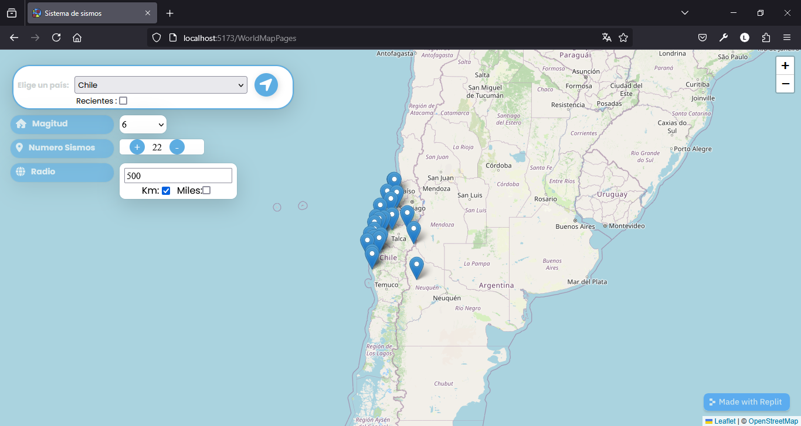

## Sistema de gestion analisis de sismos a escala mundial

El sistema funciona usando la API gratuita del servicio del geologico de Estados Unidos https://www.usgs.gov/ el sistema se actualiza cada 30 segundos tiene registros de terremtos que han pasado en la tierra tambien tiene su calculadora de escala ritcher con la formula matematica logaritmica base 10 el sistema puede realizar hasta 10 peticiones 

## Funcionamiento y uso

### Home

terremotos en las ultimas horas:

.PNG)

### Mapa

para poder usarlo en menu esta la opcion  mapa hay 2 mapas 

1. General:

.PNG)

 ---
 escoge el pais con los datos suministrados si seleccionas la opcion recientes el te trae los terremtos mas recientes 

---
En la opcion mas info... no lleva a la pagina oficial del servicio geologico de estados unidos
.PNG)

---
.PNG)

## Informacion mas detallada
En la opcion fechas de sismos es para datos mas detallados como son coordenadas datos mas de precision:

### vamos ver los registros de los 5 terremotos mas poderosos

.PNG)
1. Terremoto de valdivia - 1960
Coordenadas decimales Formato simple : *-39.81422, -73.24589*

.PNG)

---
2. Terremoto de indonesia - 2004
Coordenadas decimales Formato simple : *5.54167, 95.33333*

.PNG)

---
3. Terremoto de alaska - 1964 
Coordenadas decimales Formato simple
*61.21806, -149.90028*

.PNG)

---
4. Terremoto y tsunami de japon - 2011
Coordenadas decimales Formato simple
*38.26667, 140.86667*

.PNG)

---

5. Terremoto de Kamchatka - 1952
Coordenadas decimales Formato simple
*56.32035, 160.84541*
.PNG)

---

## Biblioteca de terremotos

### Ultimos dias
.PNG)

---

### Ultimos 7 dias
.PNG)

---

### Ultimos 30 dias

.PNG)

## Calculadora de sismos Escala de ritcher

### Ecuación del base logaritmica base 10:

.PNG)

### Escalas de los sismos:

.PNG)

### Calculadora 

.PNG)

---

.PNG)

